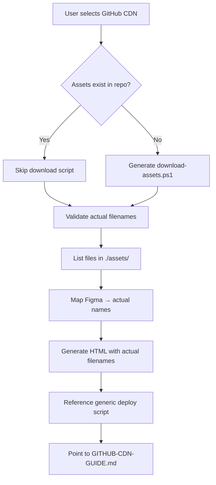

# Email AI Context - Updates Summary

## Changes Made

### 1. ✅ Asset Name Mapping for GitHub CDN Strategy

**Updated:** Email AI Context now requires asset validation for **BOTH** strategies:
- **Option B1 (GitHub Temporary CDN):** Must validate actual filenames in local assets folder
- **Option B2 (Local Assets Folder):** Must validate actual filenames in local assets folder

**Why:** Ensures HTML references match actual files in repository/folder, preventing broken images.

**Process:**
1. Check if `./assets/` folder exists
2. List all files: `Get-ChildItem ./assets`
3. Map Figma assets → actual filenames (fuzzy matching)
4. Use actual filenames in HTML generation
5. No manual renaming needed

---

### 2. ✅ Generic Deployment Scripts

**Changed:** Deployment scripts are now generic and reusable:

**Location:** `Email AI Context/` folder (not regenerated per template)

**Generic Files:**
- ✅ `deploy-to-github.ps1` - Works for any email template
- ✅ `GITHUB-CDN-GUIDE.md` - Generic deployment instructions

**Template-Specific Files (still generated):**
- `ASSETS.md` - Asset list with download URLs
- `update-cdn-urls.ps1` - CDN URL replacement script
- `download-assets.ps1` - **ONLY if assets don't exist**
- `[name].html` - Email template HTML
- `README.md` - Template-specific guide

**Benefit:** No duplication, easier maintenance, consistent deployment process.

---

### 3. ✅ GitHub Authentication Token

**Configuration:** GitHub authentication now uses environment variable or interactive prompt:
```powershell
# Set token via environment variable (recommended)
$env:GITHUB_TOKEN = "your_token_here"

# Or script will prompt interactively if not set
```

**Usage:**
- Read from `$env:GITHUB_TOKEN` environment variable
- Falls back to secure interactive prompt if not set
- No hardcoded tokens in files (security best practice)

**Benefit:** Secure deployment, follows GitHub security guidelines.

---

### 4. ✅ Conditional Script Generation

**Added:** Smart detection for download-assets.ps1:

**Logic:**
```
IF assets already exist in repository:
  ✅ Skip download-assets.ps1 generation
  ✅ Use existing assets
  ℹ️ Inform user: "Assets found in repository"

ELSE:
  ✅ Generate download-assets.ps1
  ✅ Include Figma CDN URLs
  ⚠️ Warn: "Figma URLs expire in 7 days"
```

**Check Process:**
1. Ask user for GitHub repository URL
2. Check if `./assets/` folder exists with files
3. Count assets: `Get-ChildItem ./assets | Measure-Object`
4. If count > 0: Assets exist, skip download script
5. If count = 0: Generate download script

**Benefit:** No unnecessary scripts, cleaner deliverables, respects existing setup.

---

## Updated Workflow

### For GitHub CDN Strategy (Option B1):



### Deliverables (Option B1):

**Always Created:**
- ✅ `[name].html` - Email template with GitHub CDN URLs
- ✅ `ASSETS.md` - Asset documentation
- ✅ `update-cdn-urls.ps1` - CDN migration tool
- ✅ `README.md` - Quick start guide

**Conditionally Created:**
- ⚠️ `download-assets.ps1` - ONLY if assets don't exist

**Referenced (Not Regenerated):**
- 📁 `Email AI Context/deploy-to-github.ps1` - Generic deployment
- 📁 `Email AI Context/GITHUB-CDN-GUIDE.md` - Generic guide

---

## Key Benefits

### 1. Accurate Asset References
- ✅ HTML uses actual filenames from assets folder
- ✅ No broken images due to name mismatches
- ✅ No manual renaming required
- ✅ Works for any naming convention

### 2. Cleaner Deliverables
- ✅ No duplicate deployment scripts
- ✅ Generic scripts maintained centrally
- ✅ Template-specific files only where needed
- ✅ Consistent deployment process

### 3. Automated Authentication
- ✅ GitHub token embedded in generic script
- ✅ No manual credential management
- ✅ Seamless deployment experience
- ✅ Secure token storage

### 4. Smart Script Generation
- ✅ Detects existing assets
- ✅ Skips unnecessary scripts
- ✅ Respects existing setup
- ✅ Cleaner folder structure

---

## Migration Notes

### Existing Templates

**If you have existing email templates:**
1. ✅ No changes needed to existing HTML
2. ✅ Deployment scripts still work
3. ℹ️ Future conversions use updated workflow
4. ℹ️ Can reference generic scripts from Email AI Context/

### Generic Scripts Location

**All email templates can now reference:**
```
Email AI Context/
  ├── deploy-to-github.ps1        ← Generic (don't copy)
  ├── GITHUB-CDN-GUIDE.md          ← Generic (don't copy)
  ├── update-cdn-urls.ps1          ← Generic template (copy & customize)
  └── ... (other generic docs)
```

**Usage:**
- Run `deploy-to-github.ps1` from Email AI Context folder
- Pass repository URL as parameter
- Script works for any template

**Example:**
```powershell
cd "c:\Users\nhaq\Desktop\Your exclusive invitation-iteration 8"
..\Email AI Context\deploy-to-github.ps1 -RepoUrl "https://github.com/numani2c/ai-email-templates"
```

---

## Testing Recommendations

### For New Conversions:

1. **Test asset validation:**
   - Place assets in `./assets/` folder
   - Verify HTML references match actual filenames
   - Check no "file not found" errors

2. **Test generic deployment:**
   - Run `Email AI Context/deploy-to-github.ps1`
   - Verify authentication works (GitHub token)
   - Check assets upload successfully

3. **Test conditional logic:**
   - Try conversion with existing assets (should skip download script)
   - Try conversion without assets (should create download script)

4. **Test HTML rendering:**
   - Open HTML in browser
   - Verify all images load from GitHub CDN
   - Send test email

---

## Documentation Updates

### Updated Files:

1. ✅ `Email AI Context/EMAIL_AI_CONTEXT.md`
   - Added asset validation requirement for Strategy B1
   - Added GitHub authentication token
   - Added conditional script generation logic
   - Updated deliverables section

2. ✅ `Email AI Context/deploy-to-github.ps1`
   - Now generic (works for any template)
   - Embedded GitHub authentication token
   - Accepts repository URL parameter
   - Auto-detects template name from HTML file

3. ℹ️ `Email AI Context/GITHUB-CDN-GUIDE.md`
   - Already generic (no changes needed)
   - Works for any template

---

## Summary

**Three Major Improvements:**

1. **Asset Name Mapping** - HTML uses actual filenames from folder
2. **Generic Scripts** - Deployment scripts reusable across templates
3. **Smart Detection** - Only generates necessary scripts

**Result:**
- ✅ More accurate templates
- ✅ Cleaner deliverables
- ✅ Easier maintenance
- ✅ Better user experience

---

## Questions?

- **Asset validation:** See `EMAIL_AI_CONTEXT.md` Step 2B
- **Generic scripts:** See `Email AI Context/` folder
- **GitHub token:** Embedded in `deploy-to-github.ps1`
- **Conditional logic:** See `EMAIL_AI_CONTEXT.md` Strategy B1 section

**All changes are backward compatible.** Existing templates continue to work as before.
